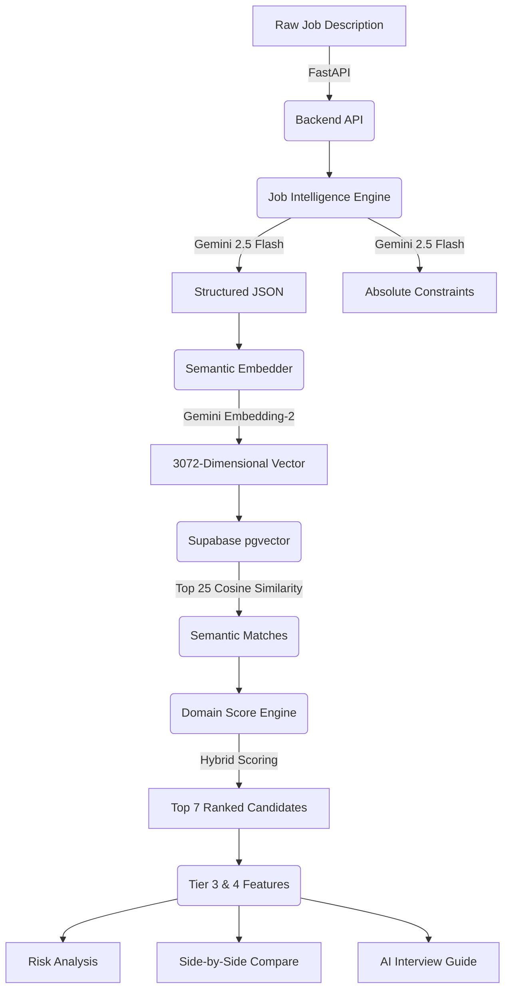

# 🚀 India Runs Hackathon: AI Job Intelligence System

Recruiters go through hundreds of profiles and still often miss the right person because keyword filters can't see what actually matters. This project is a next-generation **AI Candidate Ranking System** that ranks candidates the way a great recruiter would—by actually understanding the semantic depth of their experience.

---

## 🏗 System Architecture & Pipeline

Our pipeline uses a hybrid approach: **Semantic Vector Retrieval** combined with **Domain Fit Scoring**, followed by deep generative analysis using Gemini 2.5 Flash for Recruiter Copilot features.



---

## 🧠 Design Decisions: "Why did we build it this way?"

### 1. Why `gemini-embedding-2` and `pgvector` instead of Pinecone?
**Decision:** We chose Supabase (PostgreSQL with `pgvector`) + `gemini-embedding-2` for our semantic layer.
**Why:**
- `gemini-embedding-2` produces incredibly dense **3072-dimensional** vectors, allowing us to capture deep semantic meaning in a candidate's profile (like distinguishing between "Managed a team of 5" vs "Led cross-functional product development").
- We chose **Supabase** over Pinecone because it allows us to store the relational Candidate JSON data and the Vectors in the *exact same row*. This eliminates the "split-brain" architecture where we have to sync IDs between a Vector DB and a Relational DB. We query the vectors and fetch the full candidate profile in a single RPC call.

### 2. Why a "Hybrid" Ranking System instead of Pure Vectors?
**Decision:** We use Semantic Search to filter 5000 candidates down to 50, but we use a custom `DomainScoreEngine` to rank the Top 10.
**Why:**
- Vector math is great at finding "Software Engineers", but it struggles with temporal logic (e.g., "Has this person worked in *Finance* specifically for the last 4 years?").
- Our `DomainScoreEngine` parses the candidate's exact career history array, calculates the exact percentage of months spent in the target industry, and fuses that with the Semantic Score. This mimics a real recruiter who says, "They are both great engineers, but Candidate A has more domain experience."

### 3. Why FastAPI?
**Decision:** Built entirely on FastAPI using `asyncio`.
**Why:**
- Calls to Gemini via `google-genai` and calls to Supabase are heavily I/O bound. FastAPI's native `async/await` prevents the server from blocking while waiting on external AI processing, enabling high throughput for a massive candidate pool.

---

## 🛠 Core Features & Output Types

### 1. Job Intelligence Engine
- **Structured Parsing**: Converts messy, unstructured Job Descriptions into a clean, strictly-typed JSON schema using Gemini 2.5 Flash.
- **Constraint Extraction**: Uses LLM logic to distinguish between "Nice to Haves" and absolute dealbreakers (e.g., "Must be US Citizen").

### 2. Hybrid Candidate Filtering & Ranking
Instead of relying solely on pure vector search (which struggles with temporal logic, like "years of experience in a specific domain"), our pipeline implements a multi-stage process:
- **Semantic Match**: Embeds the structured JD and executes a `pgvector` cosine similarity search to fetch an initial pool of **25 semantically relevant candidates** that can be considered.
- **Domain Fit Engine**: A deterministic scoring algorithm that parses a candidate's career history array and calculates the exact percentage of months spent in the targeted industry.
- **Hybrid Orchestrator**: Fuses the AI vector score with the deterministic domain score to rank the 25 candidates, explicitly filtering out the **Top 7 best-fit candidates** to be interviewed.

### 3. Recruiter Copilot (AI-Powered Insights)
- **Side-by-Side Comparison**: Generates an AI-driven comparison matrix mapping multiple candidates' specific strengths and weaknesses directly against the JD.
- **Automated Risk Analysis**: Scans profiles for "Job Hopping", "Unexplained Gaps", or mismatched seniority.
- **Interview Guide & Outreach**: Auto-generates personalized outreach emails and bespoke technical interview questions designed to probe a candidate's specific weak spots.


---

## 🚦 Getting Started

### 1. Setup Environment
Rename `.env.example` to `.env` and add your keys:
```env
SUPABASE_URL=https://your-project.supabase.co
SUPABASE_KEY=your_anon_key
GEMINI_API_KEY=your_gemini_key
```

### 2. Database Setup
Run `backend/db/setup.sql` in your Supabase SQL Editor. 
*(Note: Do not create an ivfflat index, as pgvector indexes natively support up to 2000 dimensions, and our gemini embeddings use 3072 dimensions. A sequential scan is perfectly optimal for our hackathon dataset size).*

### 3. Seed Candidates
```bash
python backend/db/seed.py
```

### 4. Run the API
```bash
uvicorn backend.app.main:app --reload
```
View the Swagger docs at `http://localhost:8000/docs`.