# 🚀 India Runs Hackathon: AI Candidate Ranking System

Recruiters go through hundreds of profiles and still miss the right person because keyword filters can't see what actually matters. This project is a **two-mode AI candidate ranking system** — a live **Recruiter Copilot web app** powered by Gemini + Supabase, and a fully **offline, reproducible ranking pipeline** that satisfies all hackathon compute constraints.

---

## 🏗 System Architecture

The system operates in two modes — both share the same candidate data model and scoring logic.

```mermaid
graph TD
    subgraph "Mode 1 — Recruiter Copilot (Web App)"
        JD[Raw Job Description] -->|FastAPI| API(Backend API)
        API --> JD_Parser(Job Intelligence Engine)
        JD_Parser -->|Gemini 2.5 Flash| StructuredJD[Structured JD JSON]
        StructuredJD --> Embedder(Semantic Embedder)
        Embedder -->|Gemini Embedding-2| Vector["3072-dim Vector"]
        Vector --> Supabase(Supabase pgvector)
        Supabase -->|Top 25 Cosine Similarity| Pool[Candidate Pool]
        Pool --> RankEngine(Ranking Engine)
        RankEngine --> Copilot(Recruiter Copilot)
        Copilot --> RiskEngine[Risk Analysis]
        Copilot --> Comparison[Side-by-Side Compare]
        Copilot --> InterviewGuide[AI Interview Guide]
    end

    subgraph "Mode 2 — Offline Ranking Submission"
        JSONL[candidates.jsonl] --> RankPy(rank.py)
        RankPy -->|all-MiniLM-L6-v2 local| Embeddings[Batch Embeddings CPU]
        Embeddings --> Signals(Multi-Signal Scorer)
        Signals --> HoneypotDetect[Honeypot Detector]
        Signals --> ConsultingPenalty[Consulting Penalty]
        Signals --> AvailScorer[Availability Scorer]
        HoneypotDetect --> FinalScore[Final Composite Score]
        ConsultingPenalty --> FinalScore
        AvailScorer --> FinalScore
        FinalScore --> CSV[submission.csv — top 100]
    end
```



---

## 🧠 Design Decisions

### 1. Two-mode architecture: Copilot vs. Offline Submission

**The problem:** The web app Recruiter Copilot needs rich, contextual AI (Gemini) for generating interview questions and risk analysis in real-time. But the hackathon submission requires **zero network access during ranking** and must complete in under 5 minutes on CPU.

**The decision:** We built two independent pipelines sharing the same data model:
- **Mode 1 (Copilot):** Gemini 2.5 Flash + `gemini-embedding-2` (3072-dim) + Supabase pgvector. High-quality, cloud-native, for live recruiter use.
- **Mode 2 (Offline):** `all-MiniLM-L6-v2` via `sentence-transformers`, fully local, batch-encoded, no internet required.

### 2. Why a Two-Stage Pipeline for Offline Ranking?

**Decision:** We implemented a Two-Stage Hybrid Retrieval pipeline instead of encoding all 100,000 candidates with a transformer model.

**Why:**
- **Speed (The 5-minute constraint):** Running `all-MiniLM-L6-v2` on 100K candidates takes ~75 minutes on a CPU. 
- **Stage 1 (Deterministic Fast Pass):** We parse all 100K candidates and score them purely on structured data (Skill mapping, Experience, Honeypot/Consulting/Availability modifiers). This takes just seconds.
- **Stage 2 (Semantic Deep Dive):** We filter down to the Top 3,000 candidates and ONLY run the `sentence-transformers` embedding on them to extract deep JD context.
- **Result:** The entire pipeline finishes in **~2.8 minutes**, well within the 5-minute hackathon constraint, while still leveraging the full semantic power of `all-MiniLM-L6-v2` for the top contenders.

### 3. Why a Multi-Signal Scoring Formula?

**Decision:** Instead of ranking purely by cosine similarity, we combine 6 signals.

**Why:**  
Cosine similarity alone is naive — it ranks a "Machine Learning Engineer at Wipro with 15 years consulting" above a "Senior ML Engineer at a product startup with 6 years". Our formula applies structured corrections:

| Signal | Weight/Type | What it catches |
|---|---|---|
| Semantic similarity | 40% | Core profile-to-JD alignment |
| Skill match | 35% | Required (Python, Embeddings, VectorDB, Ranking) + Preferred skills |
| Experience score | 25% | YoE in target range (5–9 yrs), relevant domain exp, seniority |
| Honeypot penalty | ×multiplier | Impossible profiles planted by judges |
| Consulting penalty | ×multiplier | Entire careers at TCS/Wipro/Infosys/Accenture/etc. |
| Availability multiplier | ×multiplier | Inactive profiles, low response rates, long notice periods |

### 4. Why `gemini-embedding-2` and `pgvector` for the Web App?

**Decision:** Supabase (PostgreSQL + `pgvector`) + `gemini-embedding-2` for the live recruiter product.

**Why:**
- `gemini-embedding-2` produces **3072-dimensional** vectors — capturing richer semantic distinctions than smaller models (e.g., distinguishing "Managed a team" vs "Led cross-functional product development").
- Supabase lets us store the full relational candidate JSON *in the same row as the vector*, eliminating the split-brain problem of syncing IDs between a vector DB and a relational DB. A single `match_candidates` RPC returns everything in one query.

### 5. Why FastAPI?

**Decision:** FastAPI with `async/await` throughout the backend.

**Why:** Gemini API calls and Supabase RPC queries are I/O-bound. FastAPI's native `asyncio` prevents the server from blocking while waiting on external AI processing, enabling concurrent recruiter sessions without thread overhead.

---

## 🛠 Core Features

### 1. Job Intelligence Engine
- **Structured Parsing**: Converts raw JDs into a clean, strictly-typed JSON schema via Gemini 2.5 Flash.
- **Constraint Extraction**: Separates hard dealbreakers (e.g., "Must be India-based") from "nice to haves".

### 2. Offline Hybrid Ranking (`rank.py`)
Runs fully offline on CPU with no external API calls. Multi-stage pipeline:
- **Semantic Match**: Local `all-MiniLM-L6-v2` batch embeddings → cosine similarity
- **Skill Coverage**: Required (75%) + Preferred (25%) skill group matching against JD
- **Experience Score**: YoE range, relevant ML/AI domain months, peak seniority
- **Honeypot Detection**: Flags impossible profiles — date overlaps, expert skills with 0 months, implausible YoE
- **Consulting Penalty**: Down-weights candidates with 100% consulting-firm careers (TCS, Wipro, Infosys, Accenture, 30+ firms)
- **Availability Scoring**: Penalizes inactive, unresponsive, or unavailable candidates

### 3. Live Recruiter Copilot (AI-Powered Insights)
- **Side-by-Side Comparison**: AI-driven comparison matrix of candidates vs. JD requirements
- **Automated Risk Analysis**: Detects job-hopping, unexplained gaps, seniority mismatches
- **Interview Guide & Outreach**: Auto-generates personalized outreach emails and targeted technical interview questions

---

## 🚦 Getting Started

## 🏆 Reproduce Ranking (Hackathon Submission)

The offline ranking pipeline satisfies all submission constraints:

| Constraint | Status |
|---|---|
| No external API calls during ranking | ✅ Local model only |
| CPU-only | ✅ `device="cpu"` explicit |
| ≤ 5 min for 100K candidates | ✅ ~1–3 min at `batch_size=128` |
| ≤ 16 GB RAM | ✅ ~150 MB embeddings for 100K |
| ≤ 5 GB disk state | ✅ ~1.3 GB total (model + deps) |
| Network off | ✅ Model pre-cached in Docker |

### Local (Python)

```bash
# Install offline dependencies (Requires Network)
pip install -r requirements-rank.txt

# Pre-download the semantic model to your machine cache (Requires Network)
python cache_model.py

# Run — produces submission.csv (Strictly Offline / No Network)
python rank.py --candidates ./candidates.jsonl --out ./submission.csv

# Validate
python data/validate_submission.py submission.csv
```

### Docker (Recommended)

```bash
# Build — pre-caches model during build (no network at runtime)
docker build -f Dockerfile.rank -t india-runs-ranker .

# Linux / macOS
docker run --rm -v "$(pwd)":/data india-runs-ranker \
    --candidates /data/candidates.jsonl --out /data/submission.csv

# Windows PowerShell
docker run --rm -v "${PWD}:/data" india-runs-ranker `
    --candidates /data/candidates.jsonl --out /data/submission.csv
```

### Output Format

`candidate_id,rank,score,reasoning` — 100 rows, scores in `[0.0, 1.0]`, monotonically non-increasing, ties broken by `candidate_id` ascending.

Example:
```
candidate_id,rank,score,reasoning
CAND_0000031,1,1.0000,Recommendation Systems Engineer with 6.0 yrs; 4 AI core skills; response rate 0.91
CAND_0000001,2,0.9690,Backend Engineer with 6.9 yrs; 5 AI core skills; response rate 0.34
.
.
.
CAND_0000027,46,0.0956,DevOps Engineer with 3.9 yrs; 2 AI core skills; response rate 0.58; consulting-only background
```

## Web App (Recruiter Copilot) 💻

**1. Setup Environment**

Rename `.env.example` to `.env` and fill in your keys:
```env
SUPABASE_URL=https://your-project.supabase.co
SUPABASE_KEY=your_anon_key
GEMINI_API_KEY=your_gemini_key
```

**2. Database Setup**

Run `backend/db/setup.sql` in your Supabase SQL Editor.

> Note: Do not create an ivfflat index — `gemini-embedding-2` produces 3072-dim vectors, exceeding pgvector's 2000-dim index limit. A sequential scan is optimal at hackathon dataset size.

**3. Seed Candidates**
```bash
python backend/db/seed.py
```

**4. Run the API + Frontend**
```bash
# Backend
uvicorn backend.app.main:app --reload
# Frontend (separate terminal)
cd frontend && npm run dev
```
API docs: `http://localhost:8000/docs` | App: `http://localhost:3000`

---


...

